# Mini Social Feeds App

**Download & Install App (APK) via Expo:** [https://expo.dev/accounts/asad_anik/projects/mf-app/builds/6260f8c5-b88e-4ab0-9cd6-9c8527a0ff1a]

**Download & Install App (APK) via Drive:** [https://drive.google.com/file/d/1femYu9nvxtpxZ8ayf4VIUH6EBIpkevm-/view?usp=sharing]

## Summary

Mini Social Feeds App is a premium, full-featured mobile social networking application powered by a robust backend API. It allows users to connect, share their thoughts, comment on posts, and engage with a vibrant community. The app features a stunning, state-of-the-art interface with full support for light and dark modes, smooth onboarding, secure authentication, and infinite scrolling feeds.

### Key Features
- **User Authentication:** Secure user registration, login, and session management using JWT.
- **Social Feed:** Share text posts, like content, and comment on other users' posts in real-time.
- **Dynamic Theming:** Seamless switching between Light and Dark modes with persistent storage.
- **Interactive UI:** Smooth gesture-driven bottom sheets, animated onboarding screens, and premium UI components.
- **Optimized Performance:** Infinite scrolling for feeds, lazy-loaded components, and skeleton UI loaders.

### Tech Stack
- **Frontend (Mobile):** React Native, Expo, Zustand (State Management), React Navigation, Lucide Icons.
- **Backend (API):** Node.js, Express, Prisma ORM.

---

## App Screenshots

<div align="center" style="display:flex; flex-wrap:wrap; justify-content:center; gap:10px;">
  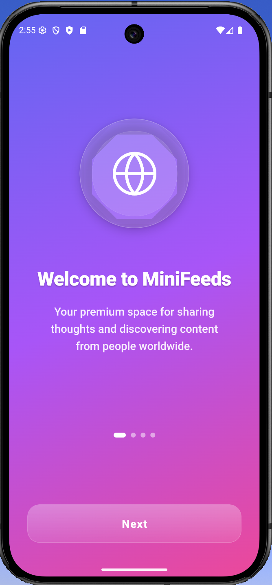
  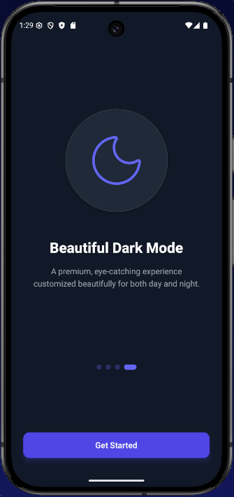
  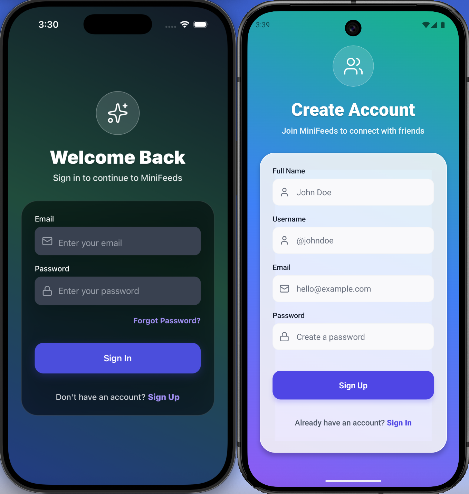
  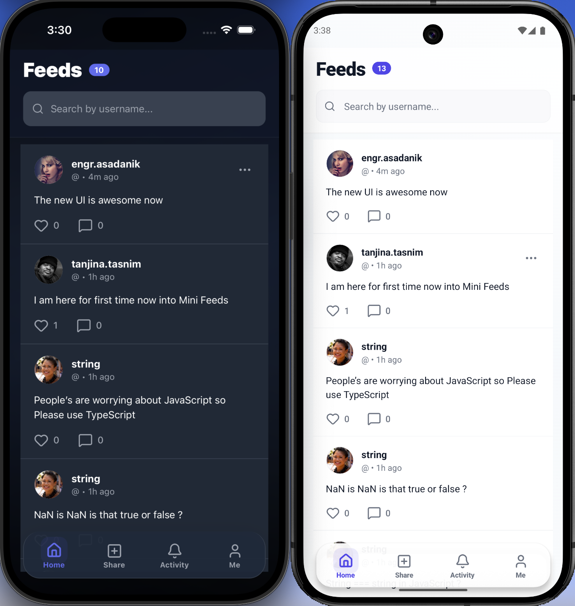
</div>

<div align="center" style="display:flex; flex-wrap:wrap; justify-content:center; gap:10px; margin-top: 10px;">
  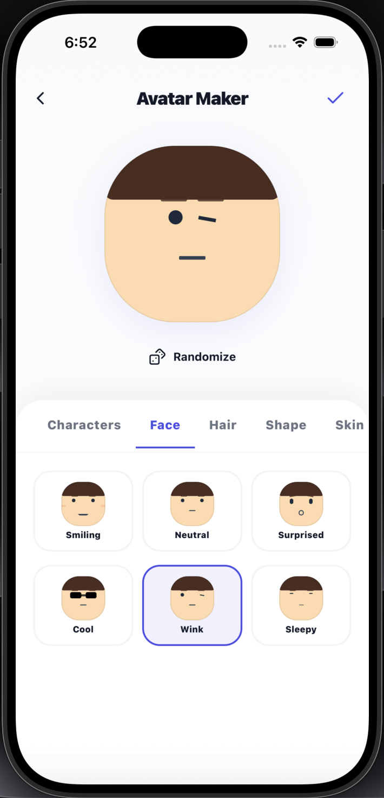
  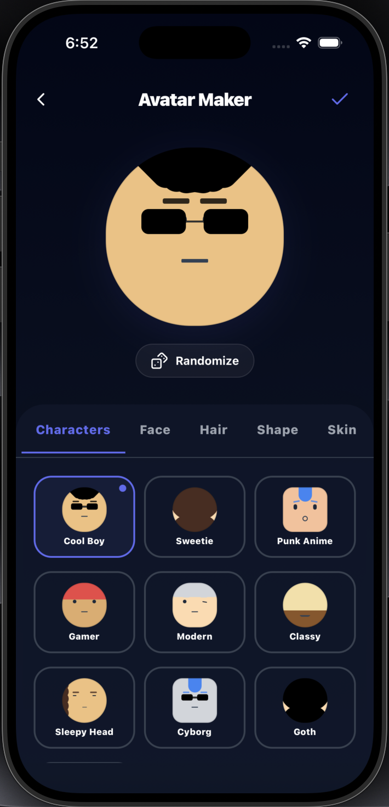
  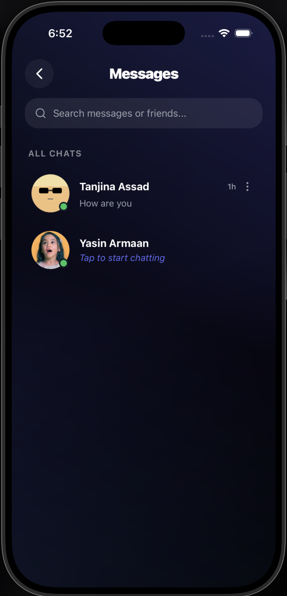
  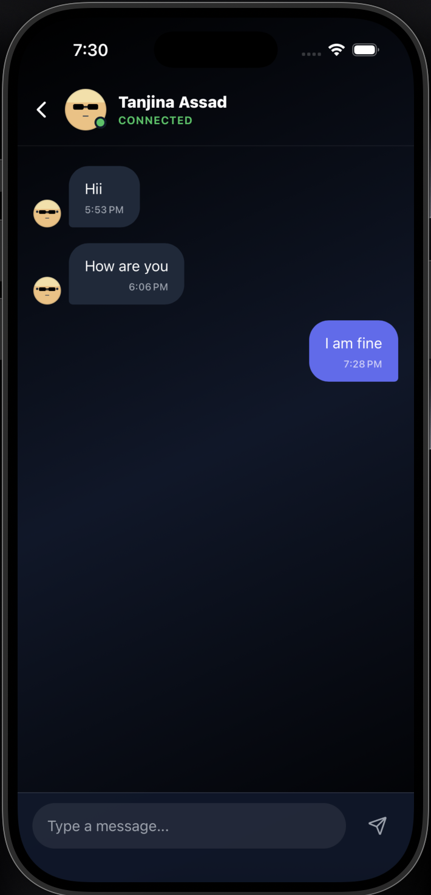
  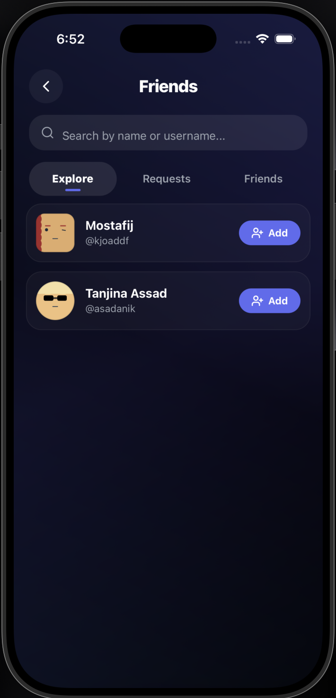
</div>

---

## API Documentation

The backend provides a fully documented Swagger API endpoint for seamless integration and testing.

🔗 **Link:** [Swagger API Docs](https://mini-feeds-app.onrender.com/api-docs)

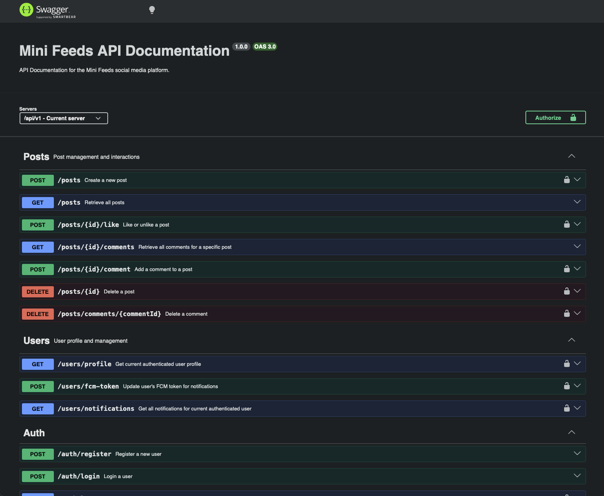

---

## Database

The robust database schema is managed via Prisma ORM, ensuring scalable and reliable data relations between Users, Posts, Comments, and Likes.

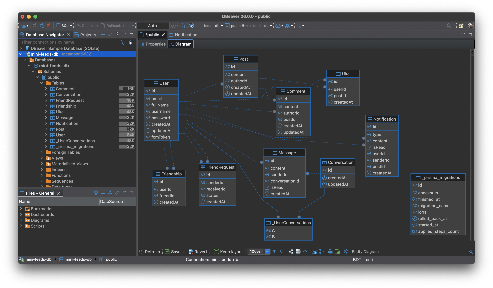

---

## Getting Started

### Prerequisites
- Node.js (v18+)
- Expo CLI (`npm install -g expo-cli`)

### Backend Setup (`mf-api`)
1. Navigate into the API directory:
   ```bash
   cd mf-api
   ```
2. Install dependencies:
   ```bash
   npm install
   ```
3. Setup your environment variables (refer to `Example.env`).
4. Apply database migrations:
   ```bash
   npx prisma generate
   npx prisma db push
   ```
5. Start the development server:
   ```bash
   npm run dev
   ```

### Mobile Setup (`mf-mobile`)
1. Navigate into the mobile directory:
   ```bash
   cd mf-mobile
   ```
2. Install dependencies:
   ```bash
   npm install
   ```
3. Ensure your local IP or backend URL is properly set in the API services.
4. Run the app:
   ```bash
   npm run android
   # or
   npm run ios
   ```
